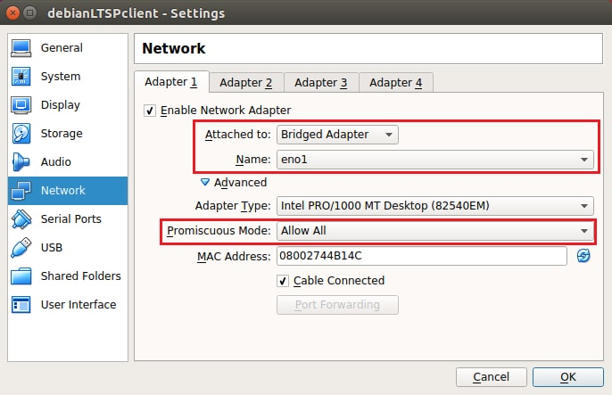
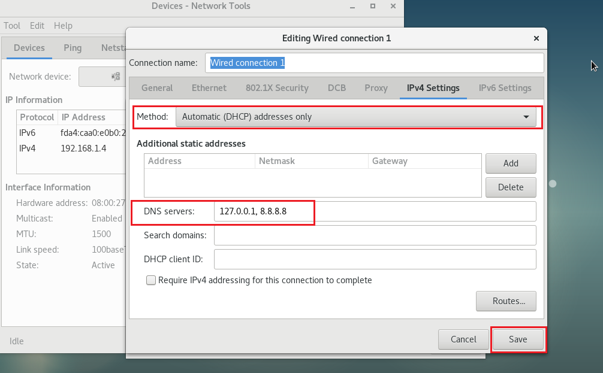
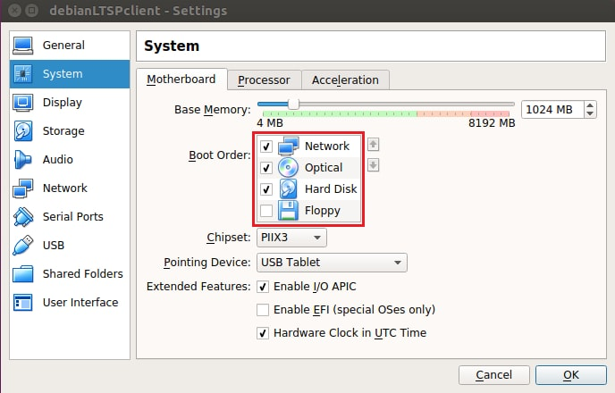
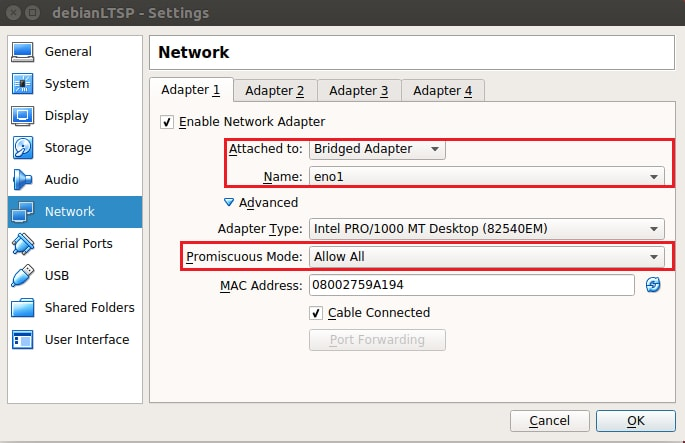
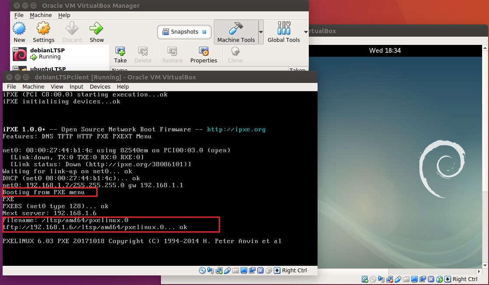

# TL;DR

 LTSP is to allow machines on the same network to boot from a one computer. Will be showing how to do it.


# Introduction

The basic concept of LTSP is to allow computers on the same network to boot from a single computer. This means with the help of LTSP we don't have to install configure and maintain all the machine of the computer lab.

We just have to do it only one. Want to install new software on all the computers?
Just do it on LTSP server and update the image. All other computers will have that software.

I was introduced to LTSP when I was looking for a project for Gooogle Summer of code. Then I was going by the list of projects proposed by Debian. There were a lot of cool projects but the one that really caught my attention was [Virtual LTSP server project.](https://wiki.debian.org/SummerOfCode2018/Projects/VirtualLtspServer) My mind exploded by thinking various possibilities for this project. Thinking about all the configuration, administration and maintenance that can be cut down with this.

Also adding the idea virtual machines to this is a cherry on top. **Think about if an entire lab wants to switch from Ubuntu to Debian**. normally that is a difficult task. But with virtual LTSP this can be done in an instant. All we need to do is turn off one VM and turn on another. That's why I think LTSP community should consider this project. With normal LTSP setup, you would need to change operating system which is still time-consuming.

# Theory

Before going into actual installation I would recommend reads to read all the basic concepts of LTSP. wiki page has a very awesome guide where you can learn about all the concepts 
<http://wiki.ltsp.org/wiki/Concepts>

# Server Setup

That should be enough theory to get started.

So I am using Debian 9 stretch. 64-bit version. your setup might vary. One this that should be noted is that current setup has much less flexibility. So the client must run on the same architecture as the server.
Example here I am using 64-bit version so the client must also be in 64 bit

Also, you need to setup up the virtual machine the right way.
Make sure **VM** is in **bridged mode** and
**Promiscuous mode** is set to **allow all**



# Installation

Installation is divided into 2 parts- 

- Server Installation
- Client Installation 

## Server Installation

1. I would  recommend users to get root privileges
   ```bash
   su - root       
   ```
2. We will be needing these 8 packages. The process may take time depending upon your internet connection. You can install them apt-get by
   ```bash
   apt install ltsp-server-standalone dnsmasq epoptes epoptes-client ltsp-client reolvconf rsync gnome-nettools              
   ```
3. Next step would be to add one user to epoptes group. Current user is root So we will add root to epoptes group with this command.
   ```
   usermod -G epoptes -a root	       
   ```
4. Now we need to Configure the network manager to use router's DHCP server. Please note that no static addresses are used in this setup
   ```
   gedit /etc/NetworkManager/NetworkManager.conf
   	comment out the line
       #dns=dnsmasq	       
   ```
5. Select the correct interface. Then click on configure. Then go to IPv4 option. Select Automatic(DHCP) address only instead of Automatic DHCP Also, add DNS servers separated by spaces 127.0.0.1 8.8.8.8
   As shown in here.

   

click save and close the window

6. Then restart the network manager with this command on terminal
   ```
   systemctl restart network-manager.service            
   ```
7. After this, we need to create a configuration file for dnsmasq. We can easily do that with.
   ```
   ltsp-config dnsmasq           
   ```
This will create ltsp-server-dnsmasq configuration file. We need to edit ltsp-server-dnsmasq.conf file.You can use any editor you like. I am using vim editor here.
   ```
   vim /etc/dnsmasq.d/ltsp-server-dnsmasq.conf 
             
      dhcp-range=192.168.1.2,192.168.1.250,8h        
      comment out port=0 to stop local dns caching
      #port=0           
   ```
8. Restart the dnsmasq with-
   ```
   systemctl restart dnsmasq.service            
   ```
9. Now we need to go to update-kernel.conf
   ```
   vim /etc/ltsp/update-kernel.conf
             
      BOOT_METHOD=NBD
      IPAPPEND=3            
   ```
   Remove NFS if it is given in the BOOT_METHOD option

10. Then fire this command to generate initrd.img file. It required you to know you kernel version. You can check it with uname -r. In my case the version is 4.9.0-6-amd64. So my command will be

   ```
   dpkg-reconfigure linux-image-4.9.0-6-amd64           
   ```
11. Next step would be generate/update compressed squashfs image from LTSP chroot. We are using cleanup option to temporarily remove accounts,logs,caches. Latest squashfs image will be created in `/opt/ltsp/images`, Latest kernel in `/var/lib/tftpboot/ltsp/amd64/`. You can do that with this command.
   ```
   ltsp-update-image --cleanup /            
   ```
12. Now we will be using ltsp-config to generate configuration file for NBD-server. Config file will be created in `/var/lib/tftpboot/ltsp/amd64/`.
   ```
   ltsp-config lts.conf          
   ```
13. Then restart our virtual machine
14. Last step - If you want to add more users you can always do it with this command. Just replace $USER with the user you want to add to epoptes group.
    ```
    gpasswd -a ${SUDO_USER:-$USER} epoptes           
    ```

# Client Installation

Make sure your client is of the same architecture as the server. I am using **debian 9 64-bit**for server. Will be using same for the client.

Open virtualbox create a new machine. Use name DebianLTSPclient. Give the memory size. In the Hard disk box select Do not add a virtual hard disk. Finally click create.

Open settings. In system setting make sure in the boot order you tick Network. This allows client to boot from network. Also it is optional to put Network in first priority.



Then go to network settings. Make sure the VM is in Bridged mode. Also name of adapter is same as that of LTSP server. Also turn on Promiscuous mode is in Allow All state.



Click OK and save the settings. Then start the client. If you have done everything according to this blog post Then you should see this.




Congratulations! You are finally booting from the LTSP server. After booting up process is compelete you should see this. Login with the user the user of Epoptes group.

# Conclusion

The idea of Virtual LTSP server is very useful. It allows us to switch Operating system of an entire computer Lab in few minutes. Just have to turn off one LTSP VM and turn another LTSP VM. Then change LTSP client.

I understand the process is little bit lengthy. Thats why I tried to automate it in my Google Summer of code Project at Debian. 

You can have a look at everything done in the final report here - 

https://gist.github.com/d78ui98/138c986dffc4d7a094e3ec1c63b545ba

# References

- <https://wiki.debian.org/LTSP/Howto>
  They have a more compelete and detailed guide. They also tell how to setup other LTSP setup
- <https://manpages.debian.org/stretch/ltsp-server/index.html>
  Refering to man pages is always a good idea. It help in understanding what each command and every option exactly did.