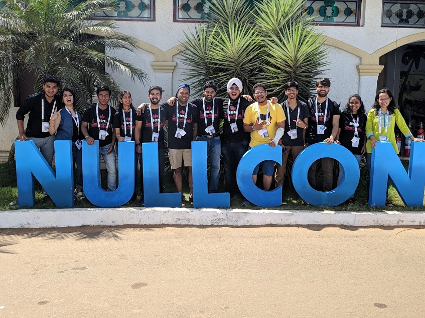

# Outline

- Introduction
- Day 1
  - f-labs
  - Bugcrowd
  - Cybersecurity and privacy talk
  - Automate Appsec and OSINT
  - Hardware hacking village
  - Rise of the Machinez
- Day 2
  -  Synopsis CTF
  - Cyber Range Workshop
- Gyan
- Mistakes to avoid for next Nullcon
- Thank you

# Introduction

Nullcon is the largest security conference in India, and this year is the 10th edition of the conference.  

Before sharing my experience let me share about myself. Currently, I am a fresher. I did my [GSoC](https://gist.github.com/d78ui98/138c986dffc4d7a094e3ec1c63b545ba) from Debian. Contributed to several open source projects like LinEmun, owasp security shepherd, Metasploit and many more. Details can be seen on my github page - https://github.com/d78ui98 

Last year I was a volunteer at Nullcon. But this year just a regular attendee. I have recently been promoted to chapter lead at NullBhopal.


# Day 1

We started planning in the early december 2018 itself. Stay and travel sorted. When the schedule came we also planned which session to attend. But I was more interested in meeting new people at nullcon. As my dear friend, [Abhinav](https://twitter.com/TweetsFromPanda) said -

```
Give priority in following way 

networking > workshops > CTFs > talks 

Don't sit idle in talks - they'll be uploaded anyway online. 
Conference is effectively for networking and meeting people.

```

So I just went to exhibition booths to say hi and look for internships or fresher jobs. This time I saw new Exhibitors like Bugcrowd, Cloudsec, Airtel, Dark matter and many more.

### f-labs

I have always been fascinated by new Innovations in IOT, That's why I was really impressed [f-lab](https://f-lab.tech/) . They are a Russian company worked in Smart home automation.  They demoed how they can control all the smart home devices without using Bluetooth or wifi. They developed their own app and entire IoT setup. According to what they explained -

- The users are provided with an app to control the smart devices.
- The app will then send a signal to its servers in Russia.
- Then turn on/off to the main hub box.  
- Hub box will send on/off signal to the individual devices 

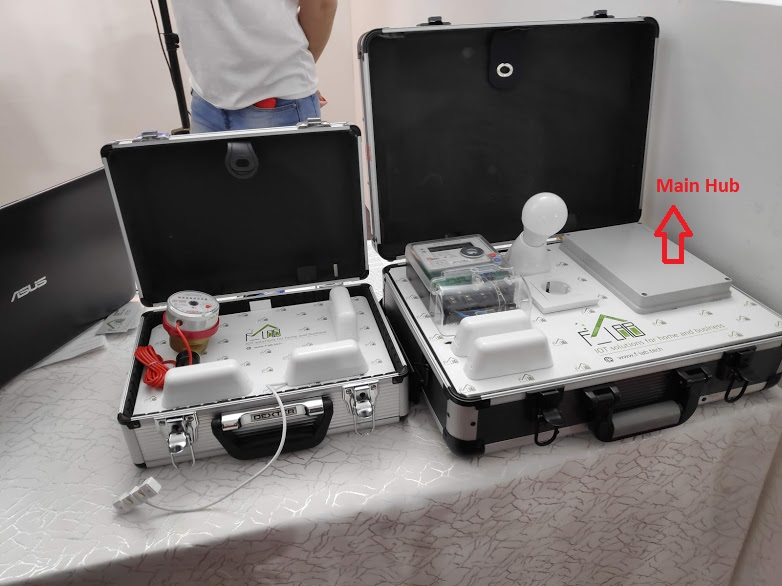

I found f-labs particularly interesting so wrote about it. Then we had a talk with almost all the exhibitors. 

### Bugcrowd

Got a very cool bugcrowd T-shirts and an awesome talk with [Jason](https://twitter.com/Jhaddix) , [Sam](https://twitter.com/samhouston) and rest of bug crowd team.

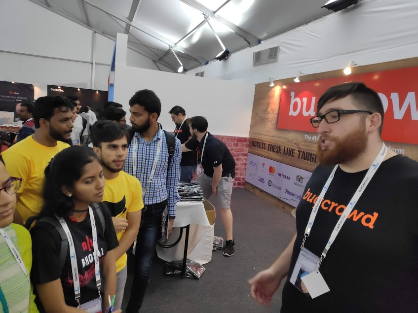


### Cybersecurity and privacy talk

It was about time we attend the session we planned.  We attended "**Cybersecurity and Privacy from the Global Lens**" by [Eva Galperin](https://twitter.com/evacide) . Also tweeted about.

https://twitter.com/deep0x00/status/1101359074149511174

I really like the energy which she talks with. Also had a talk with her in person after the talk.

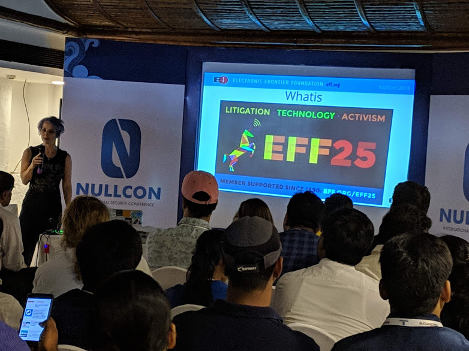


After the talk, I asked my seniors to introduce me to Technically good people. Talked about their stories of how they started, what mistakes to avoid and many more.

### Automate Appsec and OSINT

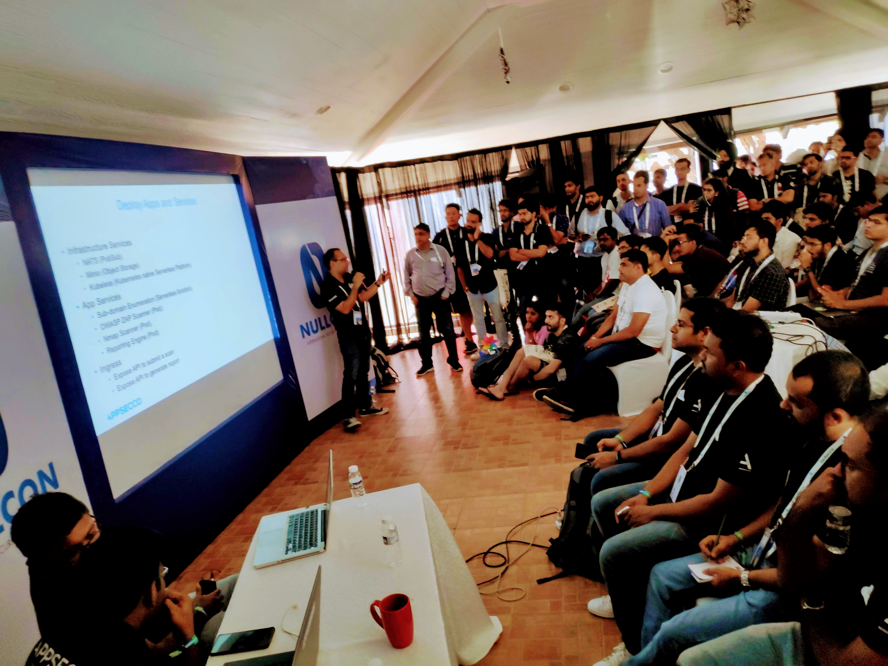

After that we had lunch and we attended workshop on "**Automate Appsec and OSINT Workflows with Containers, Kubernetes **" by [Akash](https://twitter.com/makash) and [abhishek](https://twitter.com/abh1sek) 

tweeted about it - https://twitter.com/deep0x00/status/1101410882398158849

They also posted the workshop content on Github - https://github.com/appsecco/using-docker-kubernetes-for-automating-appsec-and-osint-workflows

### Hardware hacking village

This we went to somewhere which we wanted from the beginning. 

[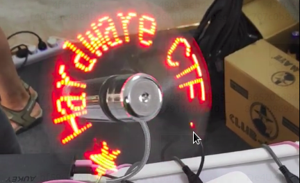](https://www.youtube.com/watch?v=Ft3UJx-yXOQ)

There we met out IOT security mentor [Abhijith](https://twitter.com/hei5enbrg) sir. He works as a hardware security researcher at Payatu. Saw everyone working on hardware CTF challenges. At that time they were working on Mirco soldering. I have it in a video will share the on youtube and share a link here if everyone permits.

I still regret not going to hardware hacking village from beginning :/

After that, I went to Bosh Exhibition booth and played their challenges. Got 9 out of 15 questions right and got a very cool bosh t-shirt. The questions were mainly of cryptography, network security.

### Rise of the Machinez

I attended that final workshop that I planned. "Rise of the Machinez" by [Anto Joseph](https://twitter.com/antojosep007) . He is an amazing speaker. The session was fun and interactive throughout. He gave Vmware VM with Jupyter notebook preinstalled and had a couple of his script. 

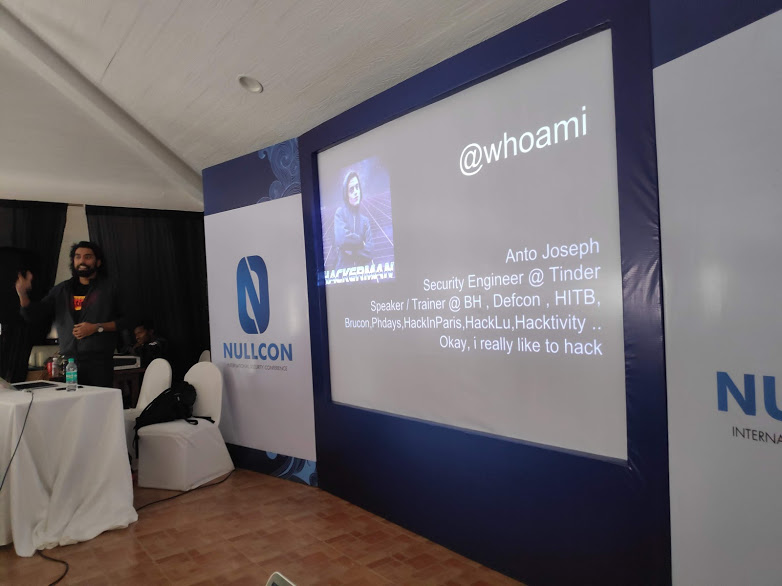

The workshop started like any other machine learning workshop by asking what is Machine learning. Someone from audience gave a very good answer -

`````
Machine learning is just a buzz word. It is basically lots of data provided to an algorithm
to make calcuated guess.
`````

Then talked about other theory in machine learning. Then he demoed how his spam mail detector. It looks for certain keywords and checks whether the mail is spam or not. In the end he also mentioned the book that he used the example from. The name of the book is [Machine learning and Security](https://www.amazon.in/Machine-Learning-Security-Protecting-Algorithms/dp/9352136934?tag=googinhydr18418-21&tag=googinkenshoo-21&ascsubtag=_k_CjwKCAiA_P3jBRAqEiwAZyWWaAKbyf4xkhjP1HSGmLYiq4sAMhfy158v3YCexdNkXNnzsxyvS5fLxBoCtmEQAvD_BwE_k_&gclid=CjwKCAiA_P3jBRAqEiwAZyWWaAKbyf4xkhjP1HSGmLYiq4sAMhfy158v3YCexdNkXNnzsxyvS5fLxBoCtmEQAvD_BwE)

Later me, megha, shreya, ravi and couple of other null chapter leads had a talk with him in person.

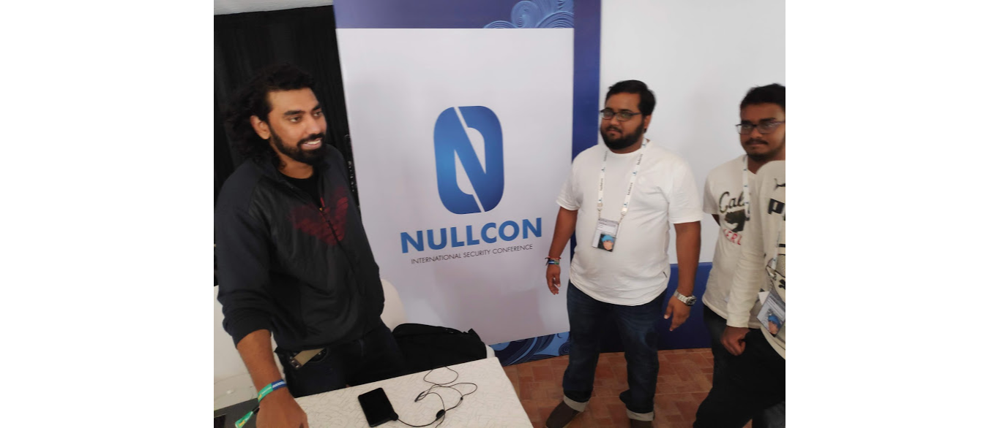

This was the end of Day 1 talks and workshops. Later we attended the Invite only Nullcon networking party met few new people. Late in the night was also went to another private party by [Bug discover](https://www.bugdiscover.com/). It was for being a volunteer at Owasp Seasides. Went to bed very late around around 3:00 am. Still regret not going to bed early.

# Day 2

.

###  Synopsis CTF

For day 2, I was little bit exhausted. But still, I thought lets work out way through the CTFs. Sheeraz and I teamed up and started working our way on Synopsis CTF.

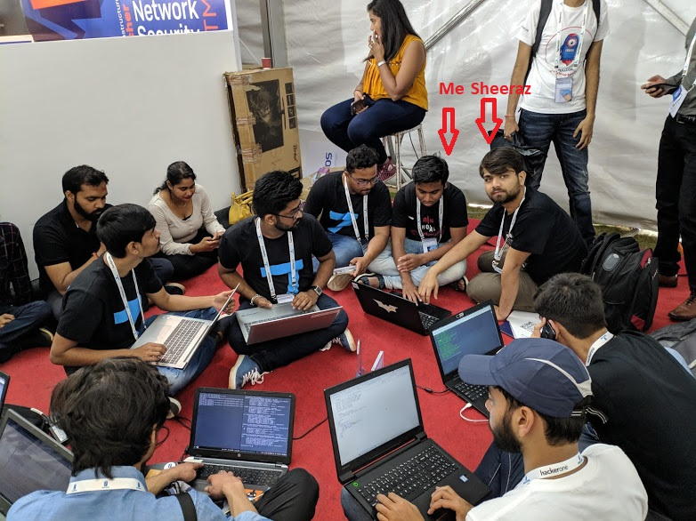 

 

There were 4 web challenges and 4 mobile challenges. I took a few sessions at Nullbhopal on reversing apps and also build a few automated script around it. So both of us worked on app challenges.

#### i. app 1 (150 pts)

The users were provided with an application to download from dropbox. App just had a single page with picture of Taj mahal which said

```
Flag is kept in the place shown above.
Go to the location and GRAB It
```

We knew we need to spoof our location. But for the location we needs to search in the source code. So I used one of my older project on github - FdroidApkDownloaderExtractor - [link](https://github.com/d78ui98/Scripts/tree/master/fdroidApkDownloaderAndExtractor)

with this I just need to do is - 

```
./jdax CTF-One.apk
```

and it will automatically give all the source code. First we were trying to automate the flag search with

````
grep -winr CTF
or
grep -winr flag
````

But none of it worked. Then we manually looked into the source code and found the location latitude and longitude. Then download a [fakegps app](https://play.google.com/store/apps/details?id=com.incorporateapps.fakegps.fre) spoofed the location and then we solved the first challenge. Showed the screenshot and got the reward for it.


#### ii. app 2 (100 pts)

app 2 said - 

```
The app is connecting to 'google.com' and looking for the string 'You Know Nothing, John Snow!' 
anywhere on the homepage. Alter the page on the fly in order to trick the app into unlocking
```

I and sheeraz had a rough idea about what to do. Somehow need to intercept the traffic between the phone and internet with some proxy or tool like burpsuite and change the request created in between. We started looking for it online and found we can do it with burpsuite. 
But for unknown reasons it was not worked. Even asked Jason, Abartan and couple of other folks playing the ctf But couldn't solve and Ended up wasting lots of time on this app.

#### iii. app 3 (200 pts)

App 3 just had a login screen. So we knew we need to look into the source code for username and password. We found it, logged in and solved another challange. 

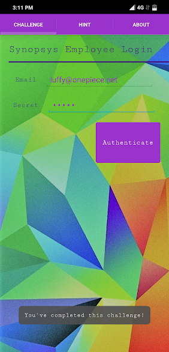

It was time up but we were still happy and and continued working on other challenges untill the link to access CTF was down.

 

## Cyber Range Workshop

Next we were planning to attend the Cyber Range workshop. Also planning to play their CTF. As it is good to enhance the Incident Response List.

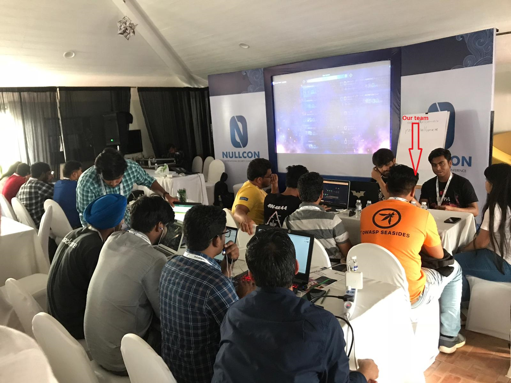

We together solved the first challenge in which one needs to connect to remote desktop with RDP. We secured second position. I was very tired because of less sleep so left early. In the end our team was second place in the end. Gadi Naveh Posted on linkedin about it.

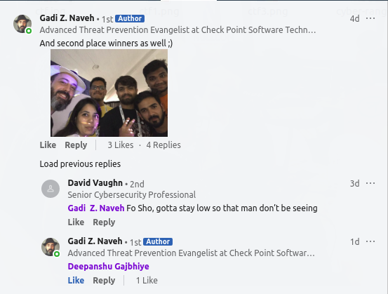

That was the end of NullconDasham..

Then there was a Null Global Chapter Lead meeting.


# Gyan

I am no expert But I think One should attend conferences with Seniors Juniors and batchmates. 

- Spend 30% of your time with your seniors asking for help and networking. 
- Spend another 30% of your time with batchmates working together in CTFs and challenge
- Spend another 30% of time with juniors helping them around. That way you contribute back to the community
- And remaining 10% alone or trying to relax, planning, etc.

# Mistakes to avoid for next Nullcon

I am writing this sections so that it could be of help to everyone and me next year

- Plan everything early. Sort travel and stay first. Since they not available or costly in the end
- Use your energy wisely. If you push yourself enough or party hard you won't be able to think or work properly on second day.
- Arrive a day or two before the conference and get scooty.
- People coming to India from other countries might feel weird to drive on Left side.
- Try talking to as many speakers as possible. Ask for advice and mistakes that they made.


# Thank you

It was a wonderful experience for me this year. I made a few mistakes but Learned a lot from them. Will try to avoid those mistakes next year. Hope this help. :)

If you have any questions you can reach me out on twitter or Linkedin.

- twitter - https://twitter.com/deep0x00
- Linkedin - https://www.linkedin.com/in/deepanshu-gajbhiye/


