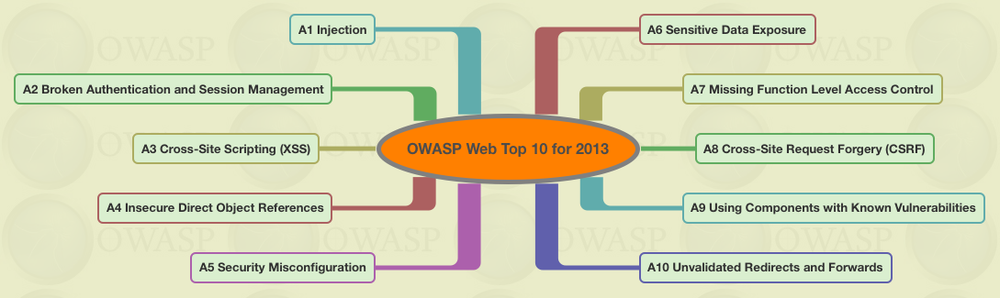

This complied list will contain all the basics like - 

- what 
- how 
- mitigation
- and individual blog on how to move in details


# A1 - Injection

They can be SQL, XML, Command injections.

Mainly caused when "data" mixed with "Commands".

```
SELECT * FROM users WHERE name = 'micheal' and password = 'xyz'	 
```

Here data is mixed with commands

What an attacker can do is

```
SELECT * FROM users WHERE name = 'micheal' and passwords = 'ben'OR '1'='1'
```


mitigation - 

- dont trust user data
- dont dont trust user 
- log analysis
- implement secure coding methodologies 

For details this [cheatsheet](https://github.com/OWASP/CheatSheetSeries/blob/master/cheatsheets/SQL_Injection_Prevention_Cheat_Sheet.md) is helpful .

# A2 - Broken Authentication and Session Management

Authentication is the process of vertification of an individual or website is who it claims to be.

[Awesome slides](https://www.slideshare.net/NoppadolSongsakaew/a2-broken-authentication-and-session-managementowasp-thailand-chapter-april-2016)

